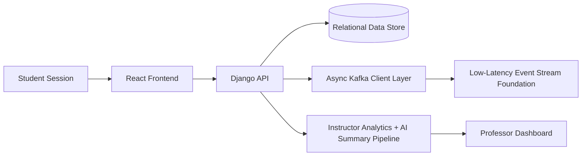

# ClassPulse

A real-time, low-latency classroom data analytics and student engagement platform designed to convert qualitative feedback bottlenecks into structured, actionable instructor insights.

---

## Table of Contents

- [Project Overview](#project-overview)
- [Architecture Snapshot](#architecture-snapshot)
- [Detailed Tech Stack](#detailed-tech-stack)
- [Key Features](#key-features)
- [Security and Policy Enforcement](#security-and-policy-enforcement)
- [Repository Structure](#repository-structure)
- [Local Development](#local-development)
- [Build and Deployment Notes](#build-and-deployment-notes)
- [Engineering Workflow](#engineering-workflow)
- [Roadmap Direction](#roadmap-direction)

---

## Project Overview

ClassPulse is built for high-signal instructional feedback loops. It enables instructors to run live assessments, capture structured and open-ended responses, and immediately interpret classroom understanding through interactive visual analytics.

Core objectives:

- Reduce instructor lag in understanding student comprehension
- Turn mixed-format responses into clear decision support
- Support both quantitative and qualitative classroom intelligence
- Enforce assessment integrity with strict retake protection

---

## Architecture Snapshot

ClassPulse is organized as a full-stack application with streaming-ready backend foundations and a modern analytics-focused frontend.



---

## Detailed Tech Stack

### Backend

- Python
- Django

### Frontend

- React
- Tailwind CSS
- shadcn/ui primitives
- Radix UI primitives
- tailwind-merge
- class-variance-authority (cva)

### Infrastructure and Streaming

- Asynchronous Kafka client support via aiokafka
- Structural foundation for low-latency ledger-style transactions
- Stream-oriented architecture readiness for real-time analytics expansion

### Engineering Tooling

- GitHub Copilot for accelerated implementation and refactoring
- Claude for AI-assisted pair programming and architectural iteration

---

## Key Features

### 1) Dynamic Analytics Dashboard

- Real-time Pie and Bar chart distributions for:
  - Multiple Choice
  - True/False
- Instructor-first visual prioritization for immediate comprehension checks
- Low-friction interpretation of class-wide answer patterns

### 2) Structured Side-by-Side Matching Layout

- Purpose-built horizontal split interface for matching questions
- Clear separation of prompts and distractor choices
- Improved scanability and reduced cognitive overhead during assessment interaction

### 3) Qualitative Essay Engine

- Contextual AI-driven summary panels for open-ended student submissions
- Unified Instructor Assistant prompt chatbox
- Dynamic querying against pooled student answer sets for rapid synthesis

### 4) Rich Content Support

- Inline LaTeX rendering for mathematical notation
- Image and diagram upload support in question flows
- Strong fit for STEM and mixed-modality instructional content

### 5) Security Guards and Retake Protection

- Frontend route protection for role-aware navigation control
- Backend policy enforcement for strict student no-retake behavior
- End-to-end guardrails that preserve quiz/session integrity

---

## Security and Policy Enforcement

ClassPulse applies a defense-in-depth approach across UI navigation and API authorization:

- Role-scoped route access for students and instructors
- Server-side verification of submission eligibility
- Anti-retake policy enforcement to prevent duplicate attempts
- Consistent policy outcomes independent of client behavior

---

## Repository Structure

- `classpulse_api/`: Django backend application and APIs
- `classpulse_web/`: React + Tailwind frontend
- `requirements.txt`: Python dependency baseline
- `package.json`: Workspace-level Node metadata (if used)
- `run_system_test.py`: System-level test runner
- `flood_test.py`: Load or stress test utility

---

## Local Development

### Prerequisites

- Python 3.11+ recommended
- Node.js 20+ recommended
- npm 10+ recommended
- Virtual environment tooling
- Kafka broker (optional for streaming experiments)

### Backend setup

```bash
cd classpulse_api
python -m venv venv
venv\Scripts\activate
pip install -r requirements.txt
python manage.py migrate
python manage.py runserver
```

### Frontend setup

```bash
cd classpulse_web
npm install
npm run dev
```

### Production build (frontend)

```bash
cd classpulse_web
npm run build
```

---

## Build and Deployment Notes

- Backend is Django-based and can be served with WSGI/ASGI patterns
- Frontend is Vite-powered and emits static assets for deployment
- Streaming layer currently reflects integrated async client capability and can be expanded into full topic-driven processing as platform scale increases

---

## Engineering Workflow

ClassPulse development emphasizes speed with maintainability:

- AI pair programming with GitHub Copilot and Claude
- Continuous UI refinement for dense analytics workflows
- Structural refactoring toward modular, stream-compatible architecture
- Backend and frontend parallel iteration to preserve product velocity

---

## Roadmap Direction

- Expand Kafka-driven event processing into production-grade consumers/producers
- Add richer instructor drill-down analytics and cohort slicing
- Improve observability for response latency and pipeline health
- Extend policy framework for institution-level assessment governance

---

## Summary

ClassPulse combines real-time classroom analytics, qualitative AI-assisted insight generation, and secure assessment policy controls into a single instructor-centric platform. The architecture is intentionally built to support current classroom workflows while laying the groundwork for higher-throughput streaming and advanced engagement intelligence.
